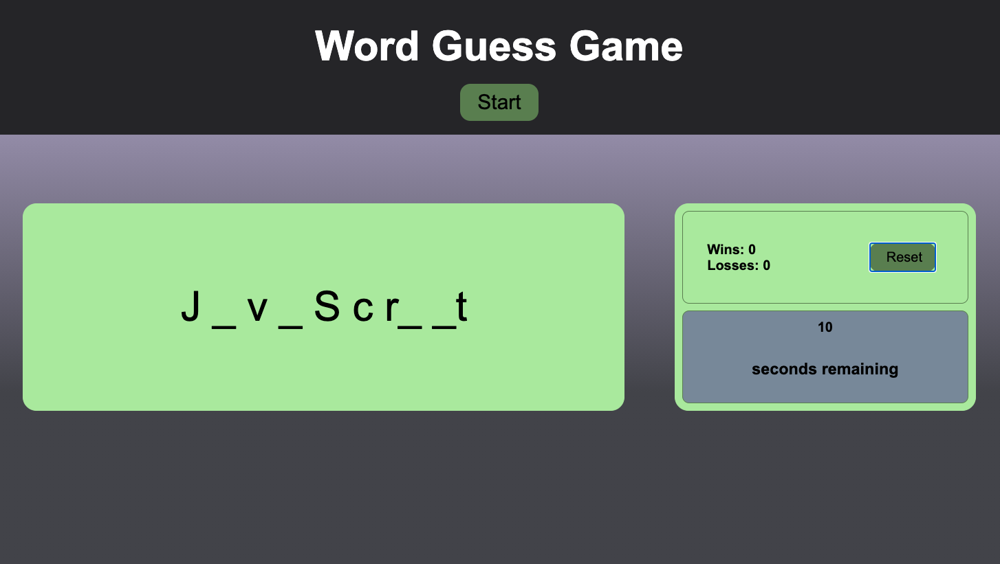
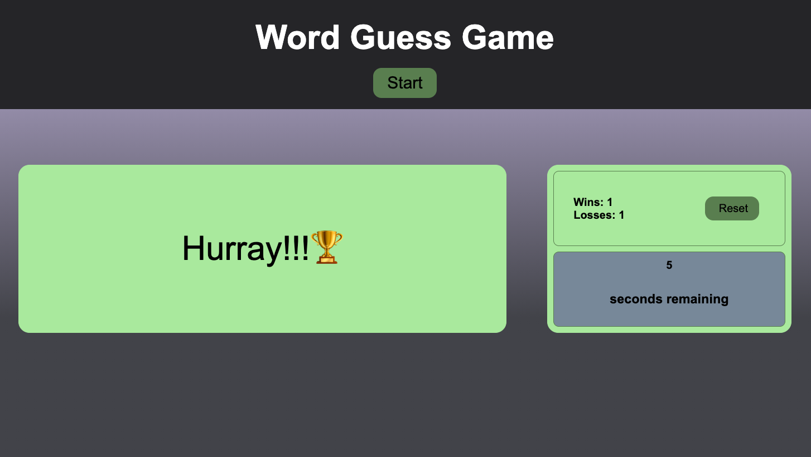
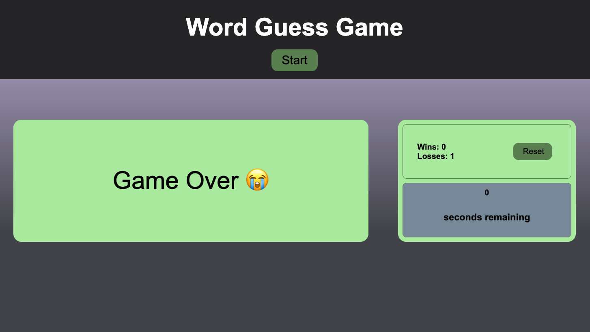
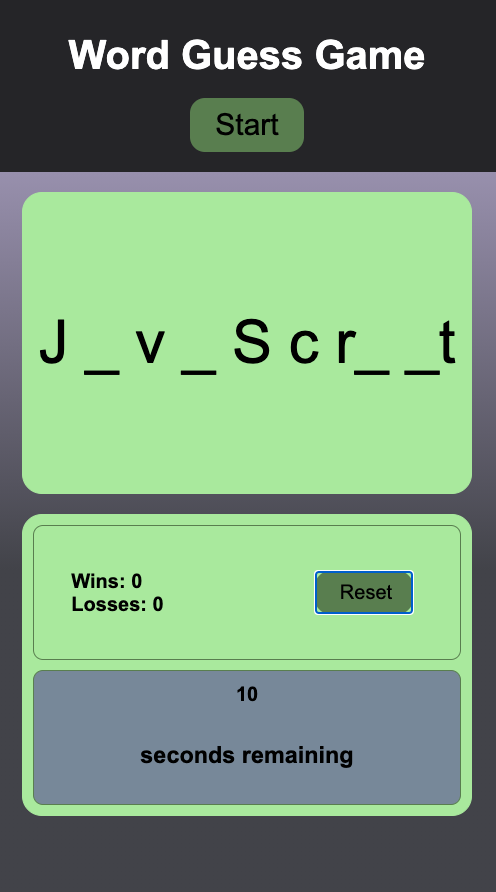

# wk4-word-guess
Build a word guessing game using JavaScript and Web APIs.

## Getting Started
Code: [Code](https://github.com/manzur-shaheed/wk4-word-guess)

Live: [github pages](https://manzur-shaheed.github.io/wk4-word-guess/)

You can clone code from [github link](https://github.com/manzur-shaheed/wk4-word-guess) and run it locally on your computer.

### Prerequisites

A computer with browser that supports javascript. To clone code from github, you need to have aceess to Internet. Also your computer should have Terminal (Unix) software installed. For Windows users, you can get it from https://www.cygwin.com/. For Mac users, it comes pre-installed with MacOS. 

### Installing

- Open a terminal.  
- Create a directory for this project.
- Change current directory to this project direcory.
- Issue the following command -

```
git clone git@github.com:manzur-shaheed/wk4-word-guess.git
```
You can then run this tool by opening index.html page from this directory in a browser.

## Deployment

- Initial window 


To start playing, click on ```Start``` button. You will be presented with a guess word - there will be ```-``` characters presented in the left card indicating length of that work. As you start pressing keys, if the key matches any letter in that word, it will be displayed. In the meantime, a timer of 10sec will start count down on right card. If you guess the word within that 10sec, you will win, otherwise you will loose. Scoreboard on right card will be updated as you win or loose. Here are few screenshots -

Win -


Loss -


This game can also be played on a mobile device. The view will change on mobile device as below -



## Built With

* [HTML](https://developer.mozilla.org/en-US/docs/Web/HTML)
* [Javascript](https://developer.mozilla.org/en-US/docs/Web/JavaScript)

## Acknowledgments
* **Billie Thompson** - [PurpleBooth](https://github.com/PurpleBooth) for the README Template.
* **Columbia Bootcamp** - for the algorithm. While **Columbia Bootcamp Gitlab** was consulted for the algorithm, code was written independently.